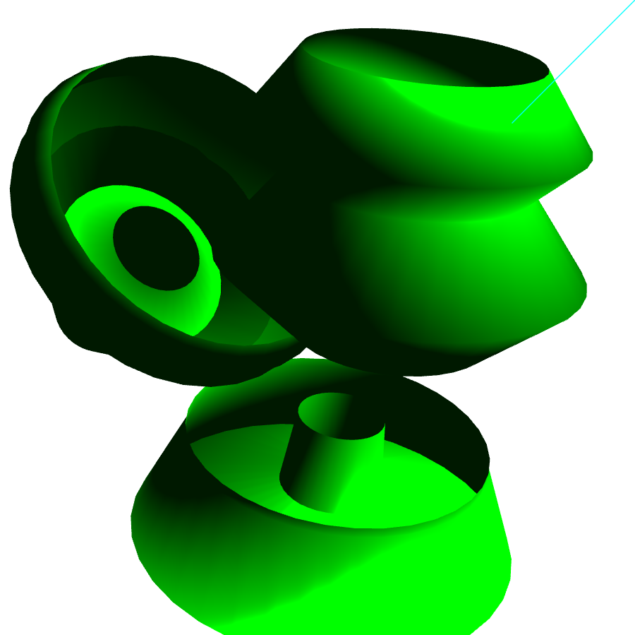

### IMPORTANT NOTE: This is not the updated version, the updated version lives in the jbeardwo.github.io repository under SORRenderer. You can try it at https://jbeardwo.github.io/SORRenderer/intro.html

# Surface of Rotation Renderer

A real-time 3D WebGL application that allows users to create and manipulate surfaces of rotation (SORs) using a custom-drawn input line. Built originally for a university graphics course, this project explores concepts in rendering, lighting, and interactive camera control.

---

##  Features

- **Interactive Shape Creation**:  
  - Click **“Create New SOR”** to begin.  
  - Left-click to place points for your profile line.  
  - Right-click to complete the line and generate a 3D surface of rotation around the Y-axis.

- **Camera Movement**:  
  - Use **WASD** to move the camera in 3D space.  
  - Use **arrow keys** to rotate the view.

- **Object Interaction**:  
  - Click and drag SOR objects to reposition them in the scene.  
  - While dragging:  
    - Use `-` and `=` to move the object closer/farther.  
    - Hold **Ctrl** while dragging to rotate the object.

- **Multiple Objects**:  
  - You can render multiple SORs.  
  - Note: objects will currently overlap in the scene.

---

##  Status & Notes

- **Work-in-progress rewrite**:  
  This is a reimplementation of an earlier version from a university course. The new structure improves organization and readability.

- **Planned features (coming soon)**:  
  - Texture mapping  
  - Multiple light sources  
  - Scene persistence/saving  
  - UI cleanup and more intuitive object selection

---

##  Tech Stack

- WebGL / JavaScript  
- Linear algebra from acuon-matrix.js
- WebGL Shader implementations

---

##  Educational Purpose

This project helped reinforce:
- Geometry and vector math (rotations, transformations)
- Low-level 3D graphics programming using WebGL
- Interactive user input handling and camera manipulation

---

##  Screenshots

---

##  Try It Out

You can clone the repo and open `index.html` in a browser that supports WebGL.
Or go to https://jbeardwo.github.io/SORRenderer/driver.html

